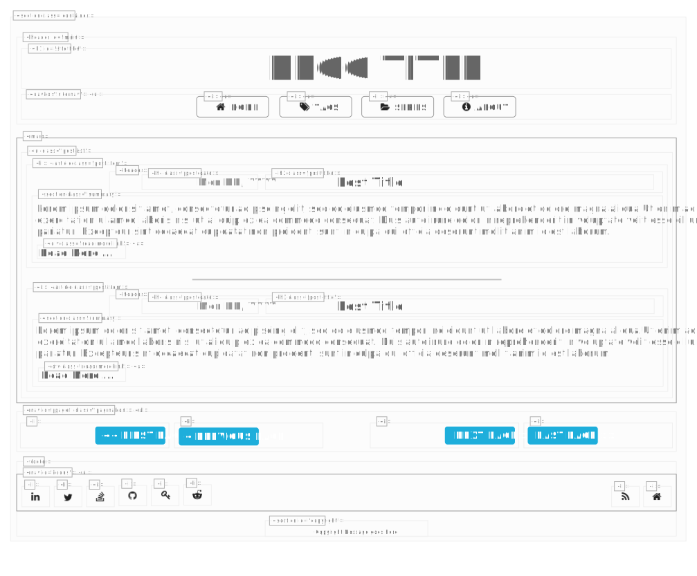
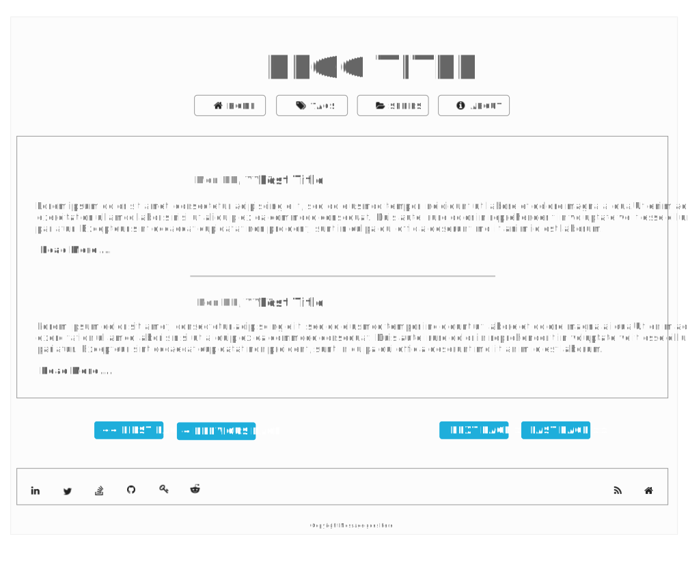

# hugo-skeletonfw-theme

## Information

[](http://opensource.org/licenses/MIT)

Responsive theme for [Hugo](https://gohugo.io/) based on [skeleton-framework](https://skeleton-framework.github.io/) suitable for blogs. This started as a fork of [hugo-theme-skeleton](https://github.com/jblawatt/hugo-theme-skeleton) but deviated so quickly that I no longer see the need to keep this repo as a fork of the original.

This theme provides...

- HTML 5 [semantic tags](https://www.w3schools.com/html/html5_semantic_elements.asp)
- Responsive Design
- Table of Contents
- Tags/Series Pages
- Social Media Buttons
- Typography Fonts

## Uses

- [stylus](http://stylus-lang.com/) for writing CSS.
- [fontawesome](http://fontawesome.io/) for icon fonts.
- [skeleton-framework](https://skeleton-framework.github.io/) on top of [normalize](https://necolas.github.io/normalize.css/) for styling.
- [Balloon.css](https://kazzkiq.github.io/balloon.css/) for hover tooltips.
- [lightbox2](http://lokeshdhakar.com/projects/lightbox2/) for images.
- [be Lazy.js](http://dinbror.dk/blazy/) for lazy loading images/iframes.
- [highlight.js](https://highlightjs.org/) for syntax highlighting.
- [jQuery](https://jquery.com) for some javascript based effects.

## Screenshots

### Structure of `index.html`



### `index.html`



## Develop

The stylesheet is written in [stylus](http://stylus-lang.com/). You will need `npm`, `yarn` and `gulp`.

```bash
npm install -g yarn
npm install -g gulp
git clone https://github.com/bhaskarvk/hugo-skeletonfw-theme
cd hugo-skeletonfw-theme
yarn # To install required dependencies
yarn run build # To compile src/css/styles.styl stylus file.
```